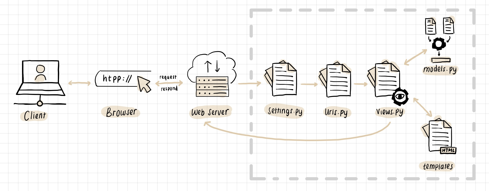
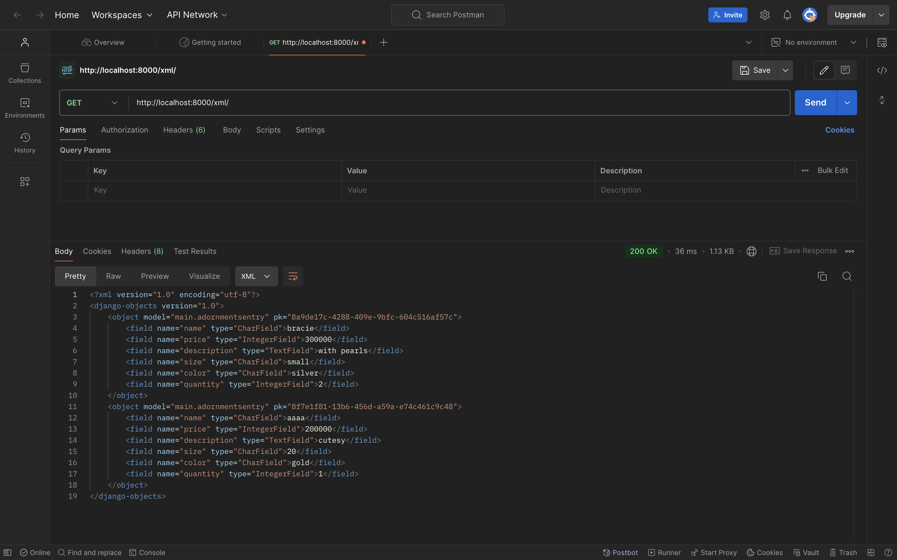
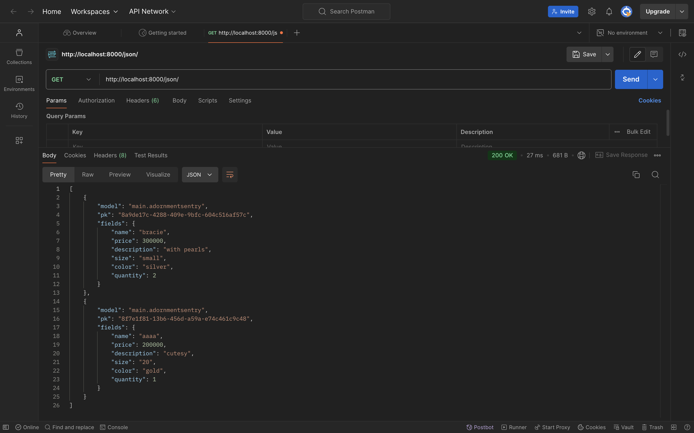
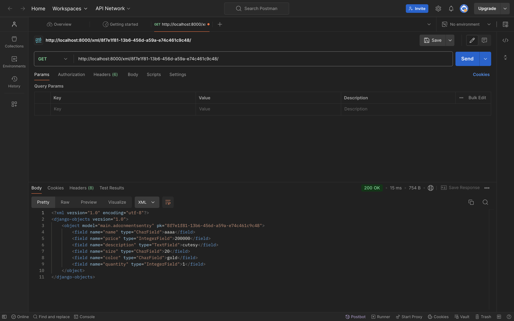
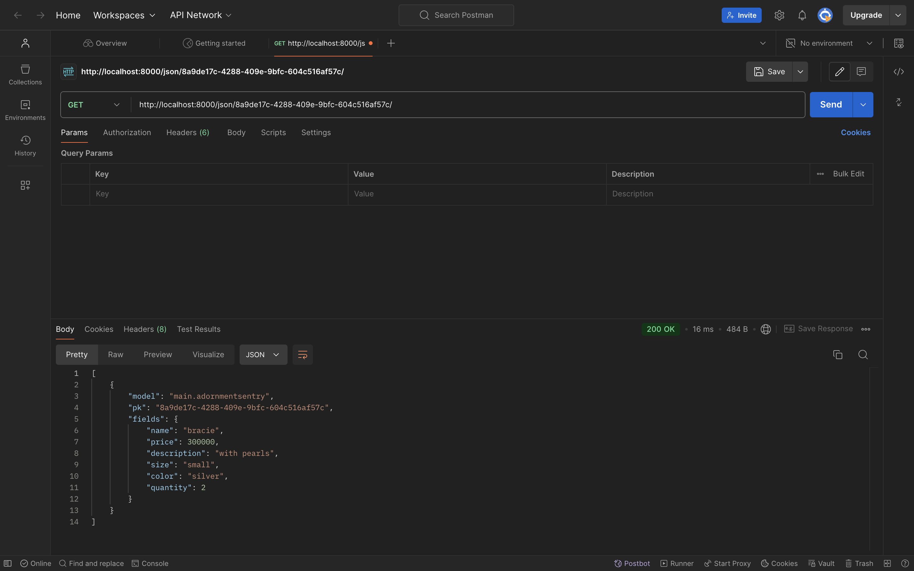

# Old-World Adornments

### Akses aplikasi pada link berikut👇🏻
[Old-World Adornments Website](http://annisa-dwiyanti-oldworldadornmentspbp.pbp.cs.ui.ac.id/)

### Datar Tugas👇🏻
<details>
<Summary><b>Tugas 2</b></Summary>

### 1. Jelaskan bagaimana cara kamu mengimplementasikan checklist di atas secara step-by-step (bukan hanya sekadar mengikuti tutorial).

1. **Setup Environment:**
   - Menginstalasi Python dan Django.
   - Menginisiasi Django.
   - Melakukan set up pengaktifan virtual environment.
   - Menambah serta menginstal requirements dan dependencies yang diperlukan dengan `pip install -r requirements.txt`.

2. **Membuat Django Project:**
   - Membuat project baru dengan perintah`django-admin startproject <nama project>`.
   - Membuat Aplikasi: Tambahkan aplikasi dengan perintah `python manage.py startapp main`, yang akan menjadi bagian utama dari proyek

3. **Menyusun Model untuk Aplikasi:**
   - Mendefinisikan `models.py` untuk kebutuhan aplikasi.
     ```
        from django.db import models

        class AdornmentsEntry(models.Model):
        name = models.CharField(max_length=255)
        price = models.IntegerField()
        description = models.TextField()
        size = models.CharField(max_length=100)
        color = models.CharField(max_length=100)
        quantity = models.IntegerField()

        @property
        def low_stock(self):
            return self.quantity < 5
     ```
   - Jalankan perintah migrasi agar perubahan masuk ke local database, dengan menggunakan perintah `python manage.py makemigrations` dan `python manage.py migrate`

4. **Membuat Views dan Templates:**
   - Membuat fungsi pada `views.py` untuk menampilkan data.
   - Membuat template pada `main.html` untuk merender tampilan dari aplikasi Django. Template HTML ini digunakan untuk menyajikan data kepada user.

5. **Melakukan konfigurasi URLs:**
   - Menambahkan routing di `urls.py` aplikasi main untuk menghubungkan `view` dengan URL.
     ```
        from django.urls import path
        from main.views import show_main

        app_name = 'main'

        urlpatterns = [
            path('', show_main, name='show_main'),
        ]
     ```

6. **Deployment:**
   - Menjalankan project Django dengan perintah `python manage.py runserver`
   - Melakukan deployment ke platform Pacil Web Service.

### 2. Buatlah bagan yang berisi request client ke web aplikasi berbasis Django beserta responnya dan jelaskan pada bagan tersebut kaitan antara `urls.py`, `views.py`, `models.py`, dan berkas HTML.



**Penjelasan:**
- **Client Request:** Client menggunakan browser untuk mengirimkan permintaan ke server.
- **urls.py:** File `urls.py` menangani permintaan dengan mencocokkan URL yang diminta dan mengarahkan permintaan tersebut ke view yang sesuai.
- **views.py:** View yang ditunjuk memproses permintaan, mengakses model untuk mendapatkan data bila diperlukan, dan kemudian menyiapkan respons.
- **models.py:** Model mengelola komunikasi dengan database, baik untuk mengambil data yang diperlukan atau menyimpan data baru.
- **HTML Template:** View merender template HTML dengan data yang diperoleh dari model, dan hasilnya dikirim kembali sebagai respons ke client.

### 3. Jelaskan fungsi git dalam pengembangan perangkat lunak!

Git merupakan alat kontrol versi yang digunakan untuk memantau perubahan pada kode sumber selama proses pengembangan perangkat lunak, membuat pengembangan perangkat lunak menjadi lebih terorganisir, efisien, dan kolaboratif
- **Version Control:** Memungkinkan pengembang untuk melacak perubahan dalam kode sumber. Setiap perubahan dicatat, sehingga mudah untuk melihat siapa yang mengubah apa dan kapan.
- **Collaboration:** Memfasilitasi kerja tim dengan memungkinkan banyak pengembang bekerja pada proyek yang sama secara bersamaan tanpa mengganggu pekerjaan satu sama lain. Ini dilakukan melalui fitur branching dan merging
- **Branching dan Merging:** Memungkinkan pengembang untuk bekerja pada fitur atau perbaikan bug secara terpisah dan menggabungkannya kembali ke cabang utama.
- **Backup dan pemulihan:** Menyimpan riwayat lengkap dari semua perubahan, sehingga jika terjadi kesalahan, pengembang dapat dengan mudah kembali ke versi sebelumnya

### 4. Menurut Anda, dari semua framework yang ada, mengapa framework Django dijadikan permulaan pembelajaran pengembangan perangkat lunak?

- **Kemudahan Penggunaan**: Menyediakan banyak fitur bawaan yang memudahkan pengembang pemula untuk memulai tanpa harus membangun semuanya dari awal. Ini membuat proses belajar menjadi lebih cepat dan efisien.
- **Dokumentasi yang Lengkap**: Memiliki dokumentasi yang sangat baik dan komprehensif, yang sangat membantu bagi pemula untuk memahami konsep-konsep dasar dan mendapatkan panduan langkah demi langkah.
- **Keamanan**: Memiliki banyak fitur keamanan bawaan yang membantu melindungi aplikasi dari serangan umum seperti SQL injection dan cross-site scripting (XSS). Ini memberikan pemahaman awal tentang pentingnya keamanan dalam pengembangan perangkat lunak.

### 5. Mengapa model pada Django disebut sebagai ORM?

Karena berfungsi sebagai jembatan antara database relasional dan objek dalam kode Python.
- **Abstraksi Database:** ORM memungkinkan pengembang untuk berinteraksi dengan database menggunakan objek Python alih-alih menulis query SQL secara langsung, membuat kode lebih bersih dan mudah dipahami.
- **Mapping Objek ke Tabel:** Dalam ORM, setiap model Django merepresentasikan tabel dalam database. Setiap atribut model merepresentasikan kolom dalam tabel tersebut. Dengan demikian, ORM memetakan objek Python ke tabel database relasional.
- **Operasi CRUD:** ORM memudahkan operasi Create, Read, Update, dan Delete (CRUD) pada database. Pengembang dapat melakukan operasi ini dengan metode Python yang sederhana tanpa perlu menulis query SQL yang kompleks.
</details>

<details>
<Summary><b>Tugas 3</b></Summary>

### 1. Jelaskan mengapa kita memerlukan data delivery dalam pengimplementasian sebuah platform?
Data delivery penting dalam pengimplementasian sebuah platform karena memungkinkan transfer data atau komunikasi anatara server dan klien ataupun antara berbagai komponen sistem, aplikasi, atau layanan. Ini memastikan bahwa data yang dibutuhkan tersedia di tempat yang tepat dan waktu yang tepat, memungkinkan integrasi yang lancar dan operasional yang efisien. Tanpa data delivery yang efektif, platform mungkin mengalami keterlambatan, kehilangan data, atau ketidakcocokan data, yang dapat menghambat fungsionalitas dan kinerja keseluruhan.

### 2. Menurutmu, mana yang lebih baik antara XML dan JSON? Mengapa JSON lebih populer dibandingkan XML?
Kedua format, XML dan JSON, memiliki kelebihan dan kekurangannya masing-masing,
- Kelebihan XML: Mendukung skema yang kompleks, validasi data, dan namespace.
- Kekurangan XML: Lebih verbose, lebih sulit dibaca manusia, dan parsing yang lebih lambat.
- Kelebihan JSON: Lebih ringan, lebih mudah dibaca manusia, dan parsing yang lebih cepat.
- Kekurangan JSON: Kurang mendukung skema yang kompleks dan validasi data.

JSON dianggap lebih baik dibandingkan XML karena kesederhanaannya dan efisiensinya dalam pengiriman data, terutama dalam aplikasi web dan API. JSON lebih mudah dibaca dan ditulis oleh manusia, serta lebih cepat diproses oleh mesin, menjadikannya pilihan yang lebih praktis dalam aplikasi web.

### 3. Jelaskan fungsi dari method `is_valid()` pada form Django dan mengapa kita membutuhkan method tersebut?
Method `is_valid()` pada form Django digunakan untuk memeriksa apakah data yang dimasukkan ke dalam form memenuhi semua persyaratan validasi yang telah didefinisikan, seperti tipe data yang benar, panjang karakter, atau pola tertentu. Method ini mengembalikan nilai boolean `True` atau `False`. Jika `is_valid()` mengembalikan `True`, data form dianggap valid dan dapat diproses lebih lanjut. Jika `False`, form akan mengandung pesan kesalahan yang menjelaskan mengapa data tidak valid. Method ini penting untuk memastikan bahwa data yang diterima oleh aplikasi adalah data yang benar dan sesuai dengan aturan yang telah ditetapkan, sehingga mencegah kesalahan dan potensi masalah keamanan.

### 4. Mengapa kita membutuhkan `csrf_token` saat membuat form di Django? Apa yang dapat terjadi jika kita tidak menambahkan `csrf_token` pada form Django? Bagaimana hal tersebut dapat dimanfaatkan oleh penyerang?
`csrf_token` digunakan untuk melindungi aplikasi web dari serangan CSRF (Cross-Site Request Forgery), di mana penyerang dapat membuat pengguna yang terautentikasi melakukan tindakan yang tidak diinginkan di aplikasi web tanpa sepengetahuan mereka. Jika kita tidak menambahkan `csrf_token` pada form Django, aplikasi menjadi rentan terhadap serangan CSRF. Penyerang dapat memanfaatkan kelemahan ini untuk mengirim permintaan berbahaya yang tampaknya sah dari pengguna yang terautentikasi, seperti mengubah kata sandi atau melakukan transaksi tanpa izin. Dengan `csrf_token`, Django memvalidasi bahwa permintaan yang dibuat berasal dari pengguna yang benar-benar mengunjungi situs, bukan dari sumber eksternal yang tidak sah.

### 5. Jelaskan bagaimana cara kamu mengimplementasikan checklist di atas secara step-by-step (bukan hanya sekadar mengikuti tutorial).
1. **Pertama**
saya membuat project Django dan memetakan struktur aplikasinya, seperti model, views, dan template.
Kemudian, saya mulai dengan membuat form dan menggunakan method is_valid() untuk memvalidasi data input.
Selanjutnya, saya memastikan bahwa setiap form memiliki csrf_token untuk melindungi aplikasi dari serangan CSRF.
Setelah itu, saya memastikan penggunaan JSON sebagai format pengiriman data yang efisien antara klien dan server.
Terakhir, saya melakukan testing secara berkala untuk memastikan bahwa semua langkah berjalan sesuai harapan dan aplikasi bebas dari masalah validasi serta keamanan.
1. **Membuat Input Form**
   - Mengimplemntasikan skeleton dengan membuat berkas `base.html` sebagai template dasar untuk halaman web lainnya di dalam proyek.
   - Mengubah Primary Key Dari Integer Menjadi UUID pada `models.py` lalu melakukan migrasi.
   - Membuat file `forms.py` untuk membuat struktur form yang akan menerima data entry yang baru.
   - Menambahkan import redirect pada `views.py` lalu membuat fungsi baru `create_adornments_entry` yang menerima parameter `request` yang nantinya akan menambah data entry secara otomatis.
   - Melakukan import fungsi yang dibuat sebelumnya dan menambhakan path URL.
   - Membuat berkas `create_adornments_entry.html`, menambhkan `csrf_token`, dan `` untuk menampilkan data d serta tombol baru yang akan redirect langsung ke form.
   - Menjalankan perintah `python manage.py runserver`

2. **Menambahkan Views untuk Menampilkan Data dalam Format XML dan JSON**
   - Menambahkan import `HttpResponse` dan `Serializer`
   - Membuat fungsi yang menerima parameter request dan menambahkan return function `HttpResponse`, untuk mengembalikan data dalam bentuk `XML`
   - Membuat fungsi yang menerima parameter request dan menambahkan return function `HttpResponse`, untuk mengembalikan data dalam bentuk `json`
   - Membuat fungsi yang menyimpan hasil query data dengan id tertentu dan menambahkan return function `HttpResponse` dengan value `application/xml` dan `application/json`

3. **Membuat Routing URL**
   - Manambahkan import untuk fungsi yang dibuat sebelumnya `show_xml`, `show_json`, `show_xml_by_id`, dan `show_json_by_id`
   - Menambahkan path URL untuk keempat fungsi yang sebelumnya diimport

### SCREENSHOTS POSTMAN
**POSTMAN XML**

**POSTMAN json**

**POSTMAN XML by ID**

**POSTMAN json by ID**

</details>

<details>
<Summary><b>Tugas 4</b></Summary>

### 1. Apa perbedaan antara HttpResponseRedirect() dan redirect()
1. **HttpResponseRedirect()**
   - `HttpResponseRedirect()` adalah subclass dari `HttpResponse` yang mengembalikan respons redirect ke klien. Digunakan untuk mengarahkan pengguna ke URL tertentu dengan mengembalikan objek `HttpResponse` yang berisi status kode HTTP 302.
2. **redirect()**
   - `redirect()` adalah shortcut function yang lebih fleksibel dan digunakan untuk mempermudah proses pengalihan. Shortcut ini mempermudah proses pengalihan tanpa harus secara manual menentukan URL, terutama jika Anda menggunakan nama view atau objek.

### 2. Jelaskan cara kerja penghubungan model Product dengan User!
Model Product dengan User dihubungkan dengan menggunakan `ForeignKey`.
   ```
      class AdornmentsEntry(models.Model):
         user = models.ForeignKey(User, on_delete=models.CASCADE)
         id = models.UUIDField(primary_key=True, default=uuid.uuid4, editable=False)
         name = models.CharField(max_length=255)
         price = models.IntegerField()
         description = models.TextField()
         size = models.CharField(max_length=100)
         color = models.CharField(max_length=100)
         quantity = models.IntegerField()
   ```
`ForeignKey` menghubungkan entri AdornmentsEntry (model Product) dengan satu pengguna (User), dengan satu pengguna dapat memiliki banyak entri. `on_delete=models.CASCADE:` jika user dihapus, maka semua entri terkait juga dihapus.

### 3. Apa perbedaan antara authentication dan authorization, apakah yang dilakukan saat pengguna login? Jelaskan bagaimana Django mengimplementasikan kedua konsep tersebut.
1. **Authentication**
   - Authetication adalah proses verifikasi identitas pengguna. Contohnya, ketika memasukkan username dan password untuk login.
   - Saat pengguna login, sistem memeriksa kredensial (seperti username dan password) terhadap data yang tersimpan. Jika cocok, pengguna dianggap terautentikasi.
2. **Athorization**
   - Authorization adalah proses menentukan hak akses pengguna yang telah terautentikasi. Ini menentukan apa yang boleh dan tidak boleh dilakukan oleh pengguna.
   - Saat pengguna login dan telah terautentikasi, sistem memeriksa izin yang terkait dengan pengguna tersebut untuk menentukan akses yang diizinkan.
Django mengimplementasikan kedua konsep tersebut dengan:
   - Authentication: Django menggunakan model `User` yang disediakan oleh `django.contrib.auth`. Pengguna dapat dibuat dan dikelola menggunakan model ini, seperti login, logout, dan verifikasi pengguna.
   - Authorization: Django menggunakan model berbasis permissions dan groups untuk mengelola otorisasi. Permissions dapat ditetapkan dan mengontrol apa yang bisa diakses oleh user.

### 4. Bagaimana Django mengingat pengguna yang telah login? Jelaskan kegunaan lain dari cookies dan apakah semua cookies aman digunakan?
Django mengingat pengguna yang telah login dengan menggunakan session dan cookies. Ketika pengguna login, Django membuat session untuk pengguna tersebut dan menyimpan session ID dalam cookie di browser pengguna. Session ID adalah identifikasi unik dan acak yang digunakan untuk mengasosiasikan pengguna dengan data sesi mereka.
**Kegunaan lain cookies**
Kegunaan lain dari cookies adalah untuk menyimpan preferensi pengguna (personalisasi), melacak aktivitas pengguna (tracking), dan meningkatkan keamanan seperti mengingat pengguna yang telah login atau mengaktifkan fitur keamanan tambahan (security).
**Keamanan cookies**
Tidak semua cookies aman digunakan. Cookies dapat digunakan untuk mencuri informasi pengguna atau melakukan serangan cyber. Oleh karena itu, penting untuk menggunakan cookies dengan bijak dan mengikuti praktik keamanan yang baik, seperti hanya dikirim melalui HTTPS (Secure Cookies), tidak dapat diakses melalui JavaScript (HttpOnly Cookies), membatasi pengiriman cookies ke situs yang sama untuk mencegah CSRF (SameSite Cookies), dan mengenskripsi informasi sensitif (Enkripsi).


### 5. Jelaskan bagaimana cara kamu mengimplementasikan checklist di atas secara step-by-step (bukan hanya sekadar mengikuti tutorial).
1. **Membuat form registrasi**
   - Pada `views.py` tambahkan `UserCreationForm` dan `messages`, lalu buat fungsi `register`.
   - Membuat file HTML untuk menampilkan form registrasi `register.html`, lalu tambahkan routing path register di `urls.py`.
2. **Membuat login**
   - Pada `views.py` tambahkan `authenticate`, `login`, dan `AuthenticationForm`, kemudian buat fungsi `login_user`.
   - Membuat form HTML untuk login dan link ke halaman registrasi `login.html`, lalu tambahkan routing path login di `urls.py`.
3. **Membuat logout**
   - Pada `views.py` tambahkan fungsi `logout_user`untuk menghapus sesi pengguna.
   - Menambahkan tombol logout yang merujuk ke `logout_user`, lalu tambahkan routing path logout di `urls.py`.
4. **Merestriksi akses halaman**
   - Menambahkan  decorator `@login_required` di fungsi `show_main` untuk membatasi akses halaman main pada file `views.py`.
5. **Menambahkan cookies `last_login`**
   - Menambahkan `response.set_cookie('last_login')` untuk menyimpan waktu login terakhir pada fungsi `login_user` yang beradi di file `views.py`.
   - Mengubah fungsi `logout_user` dengan menambahkan `response.delete_cookie('last_login')` untuk menghapus cookie setelah logout, lalu tambahkan elemen untuk menampilkan `last_login` dari cookie di `main.html`.
6. **Menghubungkan model `AdornmentsEntry` dengan `User`**
   - Menambahkan `field user = models.ForeignKey(User)` di `AdornmentsEntry` yang berada pada file `models.py`.
   - Di file `views.py`, pada create_adornments_entry, tetapkan `adornments_entry.user = request.user`. dan di `show_main`, filter adornments entries dengan `AdornmentsEntry.objects.filter(user=request.user)`.
   - Jalankan migrasi dengan menggunakan `python manage.py makemigrations` dan `python manage.py migrate`.
   - Lalu, update `settings.py` untuk mengatur variabel `DEBUG` sesuai environment `(PRODUCTION = os.getenv("PRODUCTION", False))`.
</details>

<details>
<Summary><b>Tugas 5</b></Summary>

### 1. Jika terdapat beberapa CSS selector untuk suatu elemen HTML, jelaskan urutan prioritas pengambilan CSS selector tersebut!
Jika terdapat beberapa CSS selector untuk elemen yang sama, urutan prioritasnya adalah sebagai berikut:
   - Inline Styles: Gaya yang diterapkan langsung pada elemen HTML menggunakan atribut style.
   - ID Selectors: Selector yang menggunakan ID elemen, misalnya `#header`.
   - Class, Attribute, dan Pseudo-class Selectors: Selector yang menggunakan kelas, atribut, atau pseudo-class, misalnya `.menu`, ``[type="text"], `:hover`.
   - Type dan Pseudo-element Selectors: Selector yang menggunakan tipe elemen atau pseudo-element, misalnya `div`, `::before`.
   - Important rules: `(!important)` akan mengesampingkan semua selector lain, terlepas dari urutan prioritas mereka.
Jika dua selector memiliki tingkat prioritas yang sama, yang terakhir didefinisikan dalam CSS akan diterapkan.

### 2. Mengapa responsive design menjadi konsep yang penting dalam pengembangan aplikasi web? Berikan contoh aplikasi yang sudah dan belum menerapkan responsive design!
Responsive design adalah pendekatan dalam pengembangan web yang memungkinkan tampilan situs web beradaptasi dengan berbagai ukuran layar dan perangkat, seperti desktop, tablet, dan ponsel. Hal ini penting karena pengguna mengakses situs web dari perangkat dengan resolusi yang berbeda, sehingga desain responsif memastikan tampilan yang optimal di setiap perangkat.

**Mengapa ini penting:**
   - Pengguna tidak perlu melakukan scrolling atau zooming untuk membaca konten pada layar yang lebih kecil.
   - Meningkatkan pengalaman pengguna secara keseluruhan serta memperbaiki SEO, karena Google lebih memprioritaskan situs yang responsif.
   - Mengurangi kebutuhan untuk membuat aplikasi terpisah untuk setiap perangkat.

**Contoh aplikasi yang sudah menerapkan:**
Airbnb dan Dropbox
**Contoh aplikasi yang belum menerapkan:**
Situs web lama, biasanya belum diperbarui untuk mendukung desain responsif, sehingga tampilannya tidak optimal di perangkat mobile

### 3. Jelaskan perbedaan antara margin, border, dan padding, serta cara untuk mengimplementasikan ketiga hal tersebut!
- **Margin:**
   Ruang di luar elemen, digunakan untuk mengatur jarak antara elemen dengan elemen lainnya.
- **Border:**
   Garis yang mengelilingi elemen, dapat diatur ketebalan, warna, dan gaya garisnya.
- **Padding:**
   Ruang di dalam elemen, antara konten elemen dan border.

**Cara mengimplementasikan:**
```
   .element {
      margin: 10px; /* Mengatur jarak di luar elemen */
      border: 2px solid black; /* Mengatur border elemen */
      padding: 15px; /* Mengatur jarak di dalam elemen */
   }
```

### 4. Jelaskan konsep flex box dan grid layout beserta kegunaannya!
- **Flexbox:**
   - `Flexbox` adalah layout satu dimensi yang digunakan untuk menyusun elemen secara fleksibel dalam satu baris atau kolom. Ini sangat berguna untuk membuat layout yang responsif, di mana elemen-elemen bisa disejajarkan, dipusatkan, atau didistribusikan dengan mudah. Flexbox memungkinkan pengaturan elemen secara otomatis menyesuaikan ruang yang tersedia tanpa harus mengatur ukuran secara manual.
- **Grid Layout:**
   - `Grid Layout` adalah layout dua dimensi yang memungkinkan elemen diatur dalam baris dan kolom. Grid sangat berguna untuk layout yang lebih kompleks, karena memungkinkan kontrol penuh atas posisi elemen. Kita bisa menentukan ukuran kolom, baris, dan penempatan elemen secara spesifik untuk membuat layout yang terstruktur dan rapi.

### 5. Jelaskan bagaimana cara kamu mengimplementasikan checklist di atas secara step-by-step (bukan hanya sekadar mengikuti tutorial)!
Berikut adalah penjelasan yang disesuaikan dengan implementasi berdasarkan kode dan file yang kamu miliki:

1. **Mengatur Base Template:**
   - Menambahkan tag `<meta name="viewport">` agar desain responsif di `base.html`.
   - Menyambungkan Tailwind CSS dengan menambahkan tag `<script src="https://cdn.tailwindcss.com">` di bagian `<head>` untuk styling yang fleksibel.

2. **Menerapkan Responsive Design:**
   - Dengan Tailwind, gunakan class utility seperti `flex`, `grid`, dan `w-full` untuk memastikan layout responsif.
   - Menggunakan media query bawaan Tailwind seperti `md:flex` dan `lg:grid` agar layout berubah berdasarkan ukuran layar. Misalnya, pada mobile, elemen-elemen ditampilkan secara vertikal, sementara pada desktop disusun dalam grid. Ini diterapkan pada navbar dan halaman produk.

3. **Membuat Komponen Navbar:**
   - Buat `navbar.html` dengan class Tailwind seperti `bg-[#F9F7F1]`, `shadow-lg`, dan `w-full` untuk membuat navbar yang sticky di bagian atas halaman.
   - Menambahkan tombol mobile menu untuk memastikan navbar tampil baik di layar kecil dengan menambahkan script JavaScript sederhana untuk toggle menu mobile.
   - Navbar juga memiliki kategori seperti `HOME`, `COLLECTIONS`, dan `PRODUCTS` yang mengarah ke halaman yang sesuai (`show_main`, `collections`, `products`).

4. **Mengelola Komponen Produk (Product Card):**
   - Buat file `product.html` untuk menampilkan daftar produk dalam bentuk grid menggunakan Tailwind class `grid grid-cols-3 gap-8`.
   - Setiap produk memiliki styling menggunakan class Tailwind seperti `bg-white`, `shadow-lg`, dan `rounded-lg` untuk menampilkan produk dalam kartu.

5. **Membuat Halaman Collections:**
   - Di file `collections.html`, buat tiga container yang masing-masing menampilkan gambar dan deskripsi singkat koleksi produk. Menggunakan class `grid` untuk menata layout dalam bentuk grid responsif.

6. **Implementasi Fitur CRUD:**
   - Pada halaman `product.html`, fitur CRUD diimplementasikan dengan menambahkan tombol edit dan delete. Tombol ini menggunakan class Tailwind seperti `bg-yellow-500` untuk edit dan `bg-red-500` untuk delete. Tambahkan efek hover menggunakan `hover:bg-yellow-600` dan `transition duration-300`.

7. **Testing dan Finishing:**
   - Setelah semua komponen dan halaman selesai diimplementasikan, saya melakukan testing untuk memastikan tampilan responsif di semua perangkat. Penyesuaian dilakukan terutama pada padding, margin, dan transisi hover agar interaksi lebih halus.
</details>